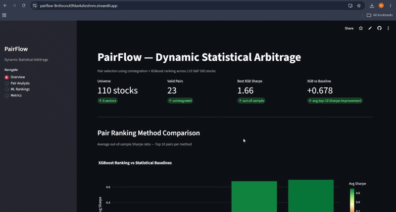

# PairFlow 📈
### ML-Enhanced Dynamic Statistical Arbitrage using Cointegration & XGBoost

[]()
[](https://pairflow-8mltvonck9hbe4ufxrxhnm.streamlit.app/)
[]()

> An end-to-end quantitative trading system that dynamically discovers, ranks, and backtests statistically arbitrageable stock pairs using classical statistical methods and Machine Learning.

---

# Live Demo

🚀 **Streamlit Dashboard**

https://pairflow-8mltvonck9hbe4ufxrxhnm.streamlit.app/

---

# Dashboard Preview

<p align="center">

</p>

---

# Project Overview

PairFlow is a complete quantitative research pipeline that automates the discovery of profitable statistical arbitrage opportunities.

Unlike traditional pair trading systems that rely only on cointegration p-values and static stock pairs, PairFlow dynamically:

- selects candidate pairs every month
- engineers statistical and temporal features
- predicts future trading quality using XGBoost
- validates results using walk-forward backtesting
- visualizes trades through an interactive dashboard

The project combines statistics, quantitative finance, machine learning, and software engineering into one end-to-end workflow.

---

# Problem Statement

Traditional statistical arbitrage strategies suffer from three major limitations:

- Static stock pairs become outdated as market relationships evolve.
- Cointegration p-values alone fail to capture overall pair quality.
- Most academic implementations ignore realistic transaction costs and walk-forward validation.

The objective of PairFlow is to build a dynamic pair selection system that adapts to changing market conditions and ranks candidate pairs using Machine Learning.

---

# Solution Overview

PairFlow introduces an ML-based ranking layer on top of traditional statistical arbitrage.

Instead of choosing the pair with the smallest cointegration p-value, the system learns which statistical characteristics historically produce higher future Sharpe Ratios.

---

# Pipeline Architecture

```
Historical Stock Prices
          │
          ▼
Data Cleaning
          │
          ▼
Sector-wise Candidate Filtering
978 pairs → 91 pairs
          │
          ▼
Parallel Cointegration Testing
91 → 23 tradable pairs
          │
          ▼
Feature Engineering
11 statistical features
          │
          ▼
XGBoost Regressor
Predict Future Sharpe Ratio
          │
          ▼
Rank Candidate Pairs
          │
          ▼
Trading Signal Generation
Z-score Strategy
          │
          ▼
Backtesting
Sharpe | Drawdown | Win Rate | PnL
          │
          ▼
Interactive Streamlit Dashboard
```

---

# Dataset

| Property | Value |
|-----------|-------|
| Stocks | 110 S&P 500 companies |
| Sectors | 6 |
| Time Period | 2018–2023 |
| Frequency | Daily |
| Source | Yahoo Finance |

---

# Methodology

## 1. Data Collection

Historical adjusted closing prices are downloaded using **Yahoo Finance**.

---

## 2. Candidate Pair Generation

To reduce computational cost:

- only stocks from the same sector are compared
- highly correlated pairs are retained
- log-ratio stationarity filter removes weak candidates

```
978 candidate pairs

↓

91 filtered pairs
```

---

## 3. Cointegration Testing

Engle-Granger Two-Step Method

- OLS Regression
- ADF Test on residuals
- Cointegration p-value

Only statistically cointegrated pairs proceed.

```
91

↓

23 cointegrated pairs
```

---

## 4. Feature Engineering

Each pair is represented using **11 engineered features**.

### Statistical

- Cointegration p-value
- Correlation
- ADF Statistic

### Spread Behaviour

- Spread volatility
- Spread skewness
- Spread kurtosis
- Mean crossings

### Temporal Features

- Half-life
- Hurst Exponent
- Beta Stability
- Rolling volatility

---

## 5. Machine Learning

Model:

- XGBoost Regressor

Target:

Future out-of-sample Sharpe Ratio

Validation:

Walk-forward validation

Training:

2018–2021

Testing:

2022–2023

---

## 6. Trading Strategy

Spread:

```
Spread = Stock_A − β × Stock_B
```

Trading Rules

| Signal | Action |
|---------|---------|
| Z > +2 | Short Spread |
| Z < -2 | Long Spread |
| Exit ±0.5 | Close Position |

Transaction costs are included during backtesting.

---

# Results

| Ranking Method | Average Top-10 Sharpe |
|---------------|-----------------------:|
| P-value Baseline | 0.015 |
| Hurst Ranking | 0.185 |
| Random Forest | 0.674 |
| **XGBoost** | **0.693** |

## Improvement

✅ **46× better top-10 pair selection quality**

Best Pair

```
CRM / META

Predicted Sharpe : 1.657

Actual Sharpe : 1.683
```

---

# Explainability

SHAP values are used to explain every XGBoost prediction.

Feature importance analysis identifies which statistical characteristics contribute most toward profitable pairs.

---

# Dashboard Features

The Streamlit dashboard provides:

- Pair Ranking
- Interactive Price Charts
- Spread Visualization
- Z-score Signals
- Cumulative PnL
- Model Predictions
- SHAP Feature Importance

---

# Tech Stack

| Category | Technology |
|------------|----------------------|
| Language | Python |
| Data | yfinance |
| Storage | Parquet |
| Processing | Pandas, NumPy |
| Statistics | statsmodels |
| Machine Learning | Scikit-learn, XGBoost |
| Explainability | SHAP |
| Visualization | Plotly, Matplotlib |
| Dashboard | Streamlit |
| Parallel Computing | multiprocessing |
| Deployment | Streamlit Cloud |
| Version Control | Git, GitHub |

---

# Project Structure

```
PairFlow/

│

├── app/
│ └── dashboard.py
│
├── assets/
│ └── dashboard_preview.gif
│
├── configs/
│ └── config.yaml
│
├── data/
│ ├── raw/
│ ├── processed/
│ └── models/
│
├── notebooks/
│
├── src/
│ ├── data_loader.py
│ ├── preprocessing.py
│ ├── feature_engineering.py
│ ├── cointegration.py
│ ├── backtester.py
│ ├── train_model.py
│ └── utils.py
│
├── tests/
│
├── requirements.txt
│
└── README.md
```

---

# Installation

Clone the repository

```bash
git clone https://github.com/Mahitajain/PairFlow.git
```

Move into project

```bash
cd PairFlow
```

Install dependencies

```bash
pip install -r requirements.txt
```

Run the dashboard

```bash
streamlit run app/dashboard.py
```

---

# Engineering Highlights

- Modular pipeline
- Walk-forward validation
- Parallel cointegration testing
- SHAP explainability
- Out-of-sample evaluation
- Transaction-cost-aware backtesting
- Interactive deployment

---

# Assumptions

- Daily closing prices are sufficient for pair discovery.
- Market impact is ignored.
- Fixed transaction cost model.
- Unlimited liquidity is assumed.
- Orders execute at closing prices.

---

# Limitations

Current implementation does not include:

- Live market execution
- Intraday trading
- Dynamic position sizing
- Portfolio optimization
- Risk parity allocation
- Stop-loss optimization
- Reinforcement learning

---

# Future Improvements

- Docker deployment
- MLflow experiment tracking
- CI/CD with GitHub Actions
- Automated monthly retraining
- Portfolio optimization
- Multi-factor ranking model
- Live Alpaca/Interactive Brokers execution
- LSTM/Transformer comparison
- Bayesian Hyperparameter Optimization

---

# Key Concepts

### Statistics

- Cointegration
- ADF Test
- OLS Regression
- Z-score
- Rolling Windows

### Finance

- Statistical Arbitrage
- Mean Reversion
- Hedge Ratio
- Sharpe Ratio
- Maximum Drawdown

### Machine Learning

- Feature Engineering
- XGBoost
- SHAP
- Walk-forward Validation

---

# Author

**Mahita Jain**

Computer Science Engineering Student

Interested in

- Machine Learning
- Quantitative Finance
- Data Science
- Algorithmic Trading

LinkedIn

https://www.linkedin.com/in/mahita-jain-b276392b1/

GitHub

https://github.com/Mahitajain

---

If you found this project interesting, feel free to ⭐ the repository.